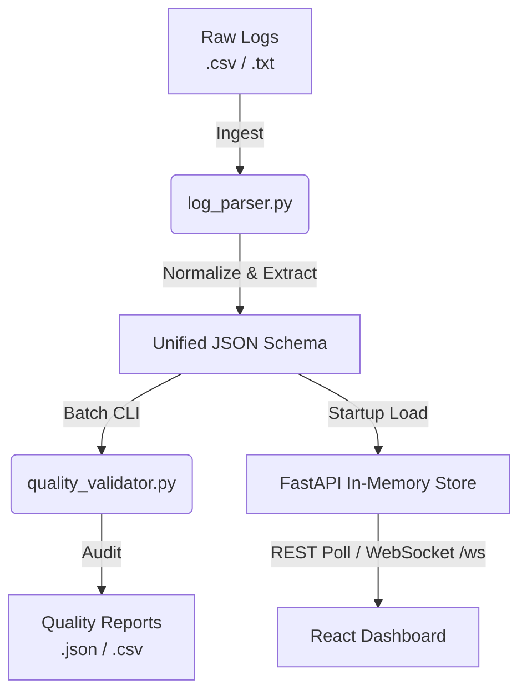

# CipherFlow

[](https://www.python.org/downloads/)
[](https://fastapi.tiangolo.com)
[](https://reactjs.org/)
[](https://vitejs.dev/)
[](https://opensource.org/licenses/MIT)

> **Unify your security data.**

CipherFlow is a high-performance security data engineering pipeline and monitoring dashboard. It is designed to ingest fragmented, multi-format security logs (Firewall CSVs, Auth space-delimited text, DNS key-value pairs), normalize them into a unified JSON schema, validate data quality in real-time, and present actionable intelligence on a sleek, responsive Midnight Crimson dashboard.


---

## 🚀 Key Features

- **Multi-Format Log Normalization**: Automatically detects and parses heterogeneous security logs (Firewall, Authentication, and DNS) into a standardized, easily queryable ISO-8601 JSONL schema.
- **Real-Time Data Quality Validation**: Ensures data integrity by running 5 modular checks (missing fields, IP validation with private-IP flagging, timestamp anomalies, duplicate detection, and suspicious pattern analysis) and generates detailed compliance reports.
- **Live Stats WebSocket (`/ws`)**: A persistent WebSocket endpoint pushes live event counts, quality scores, and notifications to connected clients every 2 seconds — no polling required.
- **Midnight Crimson Dashboard**: A premium, responsive React/Vite dashboard featuring glassmorphism design, real-time risk gauges, and unified event tables.
- **High-Throughput Processing**: Optimized core parser capable of processing >40,000 records/sec on standard consumer hardware.
- **Extensible Architecture**: Designed with modularity in mind, allowing seamless integration of new log sources and downstream SIEM integrations.

---

## 🏗️ System Architecture



---

## 🛠️ Tech Stack

### Backend
- **Core Language**: Python 3.13+
- **API Framework**: FastAPI & Uvicorn
- **Testing**: Pytest

### Frontend
- **Framework**: React 18 & Vite
- **Styling**: Vanilla CSS (Midnight Crimson Design System)
- **Icons**: Lucide React
- **Charting**: Recharts

---

## 📦 Data Schema

Every ingested log, regardless of its original format, is normalized into the following deterministic schema:

```json
{
  "event_id": "uuid4-generated-string",
  "timestamp": "2026-07-15T10:15:22+00:00",
  "source_ip": "192.168.1.15",
  "target_ip": "45.33.10.8",
  "user": null,
  "action": "TCP_CONNECT",
  "status": "BLOCKED",
  "log_type": "firewall",
  "original_line": "2026-07-15T10:15:22Z,192.168.1.15,...",
  "parsed_at": "2026-07-23T06:00:00+00:00"
}
```

---

## 💻 Installation & Setup

### Prerequisites
- **Python 3.9+** (3.13 recommended)
- **Node.js 18+** & npm

### 1. Clone the Repository
```bash
git clone https://github.com/MAFA-KHAN/CipherFlow.git
cd CipherFlow
```

### 2. Start the Backend Server
The FastAPI backend serves REST endpoints and a live-streaming WebSocket (`/ws`) that pushes stats every 2 seconds.
```bash
cd backend
pip install -r requirements.txt
uvicorn api:app --host 127.0.0.1 --port 8000 --reload
```

### 3. Start the Frontend Dashboard
The React app connects to `localhost:8000` by default.
```bash
# Open a new terminal window
cd frontend
npm install
npm run dev
```
Navigate to `http://localhost:5173` to view the dashboard.

---

## ⌨️ CLI Usage

CipherFlow provides a robust CLI for batch processing and CI/CD integration.

**1. Normalize Raw Logs:**
```bash
python backend/log_parser.py backend/sample_logs/sample_firewall_logs.csv backend/sample_logs/sample_auth_logs.txt --out backend/outputs/normalized.jsonl
```

**2. Validate Data Quality:**
```bash
python backend/quality_validator.py backend/outputs/normalized.jsonl --report backend/outputs/report.json --csv-report backend/outputs/report.csv
```

---

## 🧪 Testing & Stress Testing

CipherFlow maintains a comprehensive test suite to ensure parser accuracy and validator robustness.

**Run Unit Tests:**
```bash
pytest backend/tests/ -v
```

**Run Scale & Performance Test:**
Generate a bulk synthetic dataset (15,000+ records) to stress test the pipeline limits.
```bash
python generate_bulk_logs.py --records 5000
python backend/log_parser.py backend/sample_logs/bulk/bulk_firewall_logs.csv backend/sample_logs/bulk/bulk_auth_logs.txt backend/sample_logs/bulk/bulk_dns_logs.txt --out backend/outputs/output_bulk.jsonl
```
*(Reference `PERFORMANCE.md` for detailed benchmark results).*

---

---

<div align="center">
  <h3>Powered by MAFA</h3>
</div>
