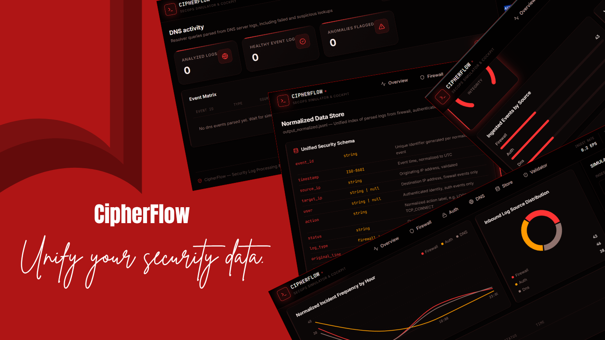

# CipherFlow

> **Unify your security data.**

CipherFlow is a high-performance security data engineering pipeline and dashboard. It takes fragmented, multi-format security logs (Firewall CSVs, Auth space-delimited text, DNS key-value pairs), normalizes them into a unified JSON schema, validates data quality in real-time, and presents the intelligence on a sleek, responsive Midnight Crimson dashboard.



## Features

- **Multi-Format Log Parser**: Automatically detects and parses Firewall, Authentication, and DNS logs into a standardized ISO-8601 JSONL schema.
- **Data Quality Validator**: Ensures data integrity by running 5 critical checks (missing fields, invalid IPs, timestamp anomalies, unrecognized types, duplicate event IDs) and generates compliance reports.
- **Real-Time API & WebSockets**: A FastAPI backend that streams normalized log data and quality notifications instantly.
- **Midnight Crimson Dashboard**: A premium, responsive React/Vite dashboard featuring glassmorphism design, real-time risk gauges, and unified event tables.
- **High Performance**: Throughput of >40,000 records/sec on standard consumer hardware. 

## Project Architecture

```
Raw Logs (.csv / .txt)
        │
        ▼
 log_parser.py          ← Single source of truth for schema
        │
   ┌────┴────────────────┐
   ▼                     ▼
CLI (Batch)        FastAPI (Real-Time WebSocket)
   │                     │
   ▼                     ▼
quality_validator.py  React Dashboard (Vite)
```

## Quick Start

### 1. Backend Server
Requires Python 3.9+.

```bash
cd backend
pip install -r requirements.txt
uvicorn api:app --host 127.0.0.1 --port 8000 --reload
```

### 2. Frontend Dashboard
Requires Node.js 18+.

```bash
cd frontend
npm install
npm run dev
```
Navigate to `http://localhost:5173` to view the dashboard.

### 3. CLI Usage

**Log Parser:**
```bash
python backend/log_parser.py backend/sample_logs/sample_firewall_logs.csv --out backend/outputs/normalized.jsonl
```

**Quality Validator:**
```bash
python backend/quality_validator.py backend/outputs/normalized.jsonl --report backend/outputs/report.json
```

## Testing & Stress Testing
Run the comprehensive pytest suite (12 tests covering parsing and validation):
```bash
pytest backend/tests/ -v
```

Generate a bulk synthetic dataset (15,000+ records) to stress test the pipeline:
```bash
python generate_bulk_logs.py --records 5000
```

---
*Powered by MAFA*
